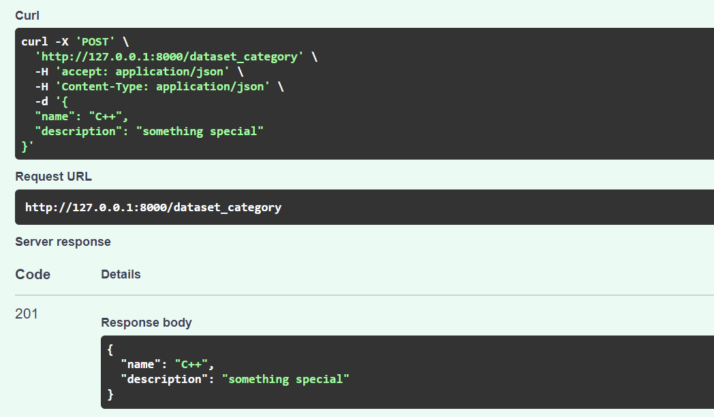

# Тестування працездатності системи (Swagger)

У цьому розділі продемонстроване повне тестування системи і взаємодії її між собою.

## Users

### Post

#### Успішне виконання

    

#### Username вже використаний раніше

    

#### Пошта вже використана раніше

    

#### Пароль вже використаний раніше

    

#### Поле username порожнє

    

#### Поле і'мя порожнє

    

#### Поле прізвища порожнє

    

#### Поле пошти порожнє

    

#### Поле паролю порожнє

    

### Get all

#### Успішне виконання

    

### Get by id

#### Успішне виконання

    

#### Зверення до неіснуючого id

    

### Put

#### Успішне виконання

    

#### Зверення до неіснуючого id

    

#### Username вже використаний раніше

    

#### Пошта вже використана раніше

    

#### Пароль вже використаний раніше

    

#### Поле username порожнє

    

#### Поле і'мя порожнє

    

#### Поле прізвища порожнє

    

#### Поле пошти порожнє

    

#### Поле паролю порожнє

    

### Delete

#### Успішне видалення

    

#### Зверення до неіснуючого id

    

## DataSet categories

### Post

#### Успішне виконання

    

#### І'мя категорії вже використане раніше

    

#### Поле і'мя категорії порожнє

    

#### Поле опису категорії порожнє

    

### Get all

#### Успішно вивелись всі категорії

    

### Get by id

#### Успішно вивелась категорія за id

    

#### Зверення до неіснуючого id

    

## Datasets

### Post

#### Успішно створився запис

    

#### Назва вже використана раніше

    

#### Поле назви порожнє

    

#### Поле опису порожнє

    

#### Зверення до неіснуючого id категорії

    

#### Зверення до неіснуючого username користувача

    

### Get all

#### Успішне виведення усіх наборів даних

    

### Get by id

#### Успішне виведення набору даних за id

    

#### Зверення до неіснуючого id набору даних

    

### Put

#### Успішне редагування набору даних

    

#### Назва вже використана раніше

    

#### Поле назви порожнє

    

#### Поле опису порожнє

    

#### Зверення до неіснуючого id категорії

    

#### Зверення до неіснуючого username користувача

    

#### Зверення до неіснуючого id набору даних

    

### Delete

#### Успішне видалення

    

#### Зверення до неіснуючого id

    

## Files

### Post

#### Успішно створився файл

    

#### Назва файлу вже використовувалась раніше

    

#### Поле назви файлу порожнє

    

#### Поле опису файлу порожнє

    

#### Поле вмісту файлу порожнє

    

#### Зверення до неіснуючого id набору даних

    

### Get all

#### Успішне виведення усіх файлів

    

### Get by id

#### Успішне виведення файлу за id

    

#### Зверення до неіснуючого id файлу

    

### Delete

#### Успішне видалення

    

#### Зверення до неіснуючого id

    

## Relationship

У системі передбачене автоматчине видалення категорій та наборів даних, якщо вони не використовуються, 
тобто до них не підв'язані жодні дані. Нижче ми розглянемо цей приклад каскадного видалення.

### Get by id

#### Зверення до категорії за  id

    

#### Зверення до набору даних за  id

    

#### Зверення до файлу за  id

    

### Delete

#### Видалення всіх файлів

    

### Get by id

#### Зверення до категорії за  id, щоб побачити результат

    

#### Зверення до набору даних за  id, щоб побачити результат

    

#### Зверення до файлу за  id, щоб побачити результат

    

